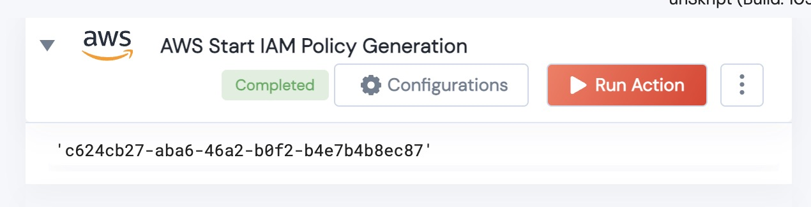

[]
(https://unskript.com/assets/favicon.png)
<h1>AWS Start IAM Policy Generation </h1>

## Description
Given a region, a CloudTrail ARN (where the logs are being recorded), a reference IAM ARN (whose usage we will parse), and a Service role, this will begin the generation of a IAM policy.  The output is a String of the generation Id.

## Lego Details
	AWS_Start_IAM_Policy_Generation(handle, region:str, CloudTrailARN:str, IAMPrincipalARN:str, AccessRole:str, hours:float)
		handle: Object of type unSkript AWS Connector.

	region: AWS region where cloudtrail logs are recorded.
	CloudTrailARN: ARN of the logs you wish to parse.
	IAMPrincipalARN: reference ARN - we are coping the usage from this account.
	AccessRole: Role that allows for access of logs
	hours: Hours of data to parse

## Lego Output
Here is a sample output.  The value is the JobID of the generation.

## See it in Action

You can see this Lego in action following this link [unSkript Live](https://us.app.unskript.io)