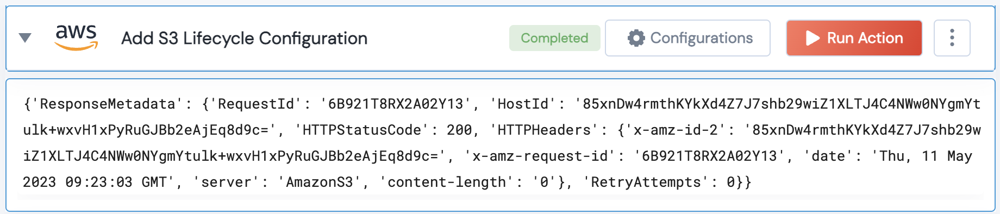

[](https://raw.githubusercontent.com/unskript/Awesome-CloudOps-Automation/master/.github/images/runbooksh_dark.png)
[](https://raw.githubusercontent.com/unskript/Awesome-CloudOps-Automation/master/.github/images/runbooksh_light.png)
<h1>Add Lifecycle Configuration to AWS S3 Bucket</h1>

## Description
Creates a new lifecycle configuration for the bucket or replaces an existing lifecycle configuration.

## Action Details
```python
aws_add_lifecycle_configuration_to_s3_bucket(handle, region: str, bucket_name:str, expiration_days:int=30, prefix:str='', noncurrent_days:int=30)
```
- handle: Object of type unSkript AWS Connector.
- bucket_name: The name of the bucket for which to set the configuration.
- expiration_days: Specifies the expiration for the lifecycle of the object in the form of days. E.g., 30 (days).
- prefix: Prefix identifying one or more objects to which the rule applies.
- noncurrent_days: Specifies the number of days an object is noncurrent before Amazon S3 permanently deletes the noncurrent object versions.

## Action Output
Here is a sample output.


## See it in Action

You can try out this action by visiting the following links:
- [Runbooks.sh](http://runbooks.sh): Open source Runbooks and Cloud Automation.
- [unSkript Live](https://us.app.unskript.io): Cloud free trial.
- Community Slack: Join the [Cloud Ops Community](https://communityinviter.com/apps/cloud-ops-community/awesome-cloud-automation) for support, questions, and comments.
