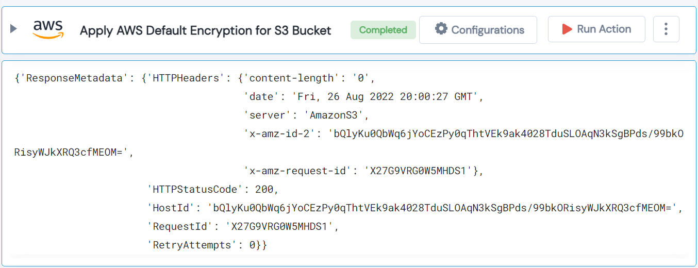

 
<h1>Apply AWS Default Encryption for S3 Bucket </h1>

## Description
This Lego apply AWS default encryption for S3 bucket.

## Lego Details

    aws_put_bucket_encryption(handle: object, name: str, region: str)

        handle: Object of type unSkript AWS Connector
        name: Name of the S3 bucket.
        region: Location of the S3 buckets.

## Lego Input
This Lego take three input handle, name and region.

## Lego Output
Here is a sample output.

## See it in Action

You can see this Lego in action following this link [unSkript Live](https://us.app.unskript.io)