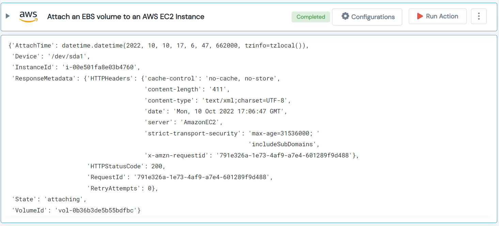

 
<h1>Attach an EBS volume to an AWS EC2 Instance </h1>

## Description
This Lego attach an EBS volume to an AWS EC2 Instance.

## Lego Details

    aws_attach_ebs_to_instances(handle: Session, region: str, instance_id: str, volume_id: str, device_name: str)

        handle: Object of type unSkript AWS Connector
        region: Location of the S3 buckets.
        instance_id: ID of the EC2 instance.
        volume_id: ID of the EBS volume.
        device_name: Name of the Device.

## Lego Input
This Lego take five inputs handle, region, instance_id, volume_id and device_name.

## Lego Output
Here is a sample output.

## See it in Action

You can see this Lego in action following this link [unSkript Live](https://us.app.unskript.io)