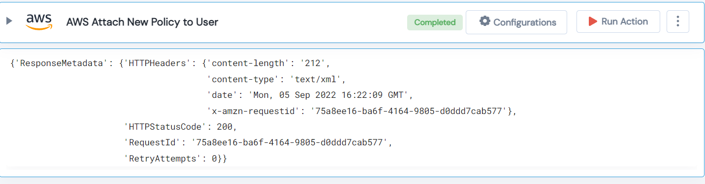

 
<h1>AWS Attach New Policy to User </h1>

## Description
This Lego attaches a new AWS Policy to User and returns the policy information as a python dictionary.

## Lego Details

    aws_attach_iam_policy(handle: object, UserName: str, PolicyName: str)

        handle: Object of type unSkript AWS Connector
        UserName: IAM user whose policies need to fetched.
        PolicyName: Policy name to apply the permissions to the user.

## Lego Input
This Lego take three inputs handle, UserName and PolicyName. 

## Lego Output
Here is a sample output.

## See it in Action

You can see this Lego in action following this link [unSkript Live](https://unskript.com)