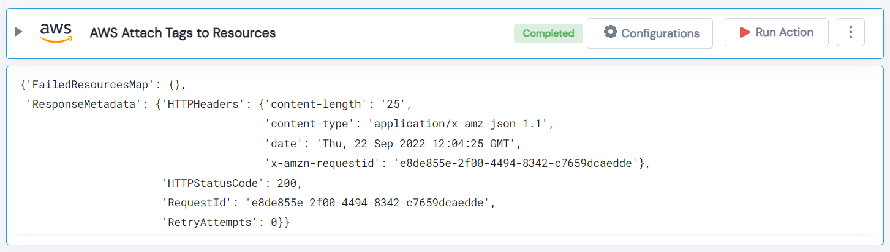

 
<h1>AWS Attach Tags to Resources </h1>

## Description
This Lego attach given tags to given resources.

## Lego Details

    aws_attach_tags_to_resources(handle, resource_arn: list, tag_key: str, tag_value: str, region: str)

        handle: Object of type unSkript AWS Connector.
        resource_arn: Resource ARNs.
        tag_key: Resource Tag Key.
        tag_value: Resource Tag value.
        region: Region to filter resources.

## Lego Input
This Lego take five inputs handle, resource_arn, tag_key, tag_value and region.

## Lego Output
Here is a sample output.

## See it in Action

You can see this Lego in action following this link [unSkript Live](https://us.app.unskript.io)

