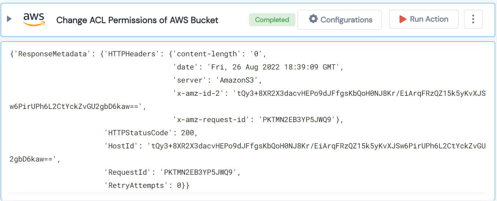

 
<h1>AWS Change ACL Permission of public S3 Bucket</h1>

## Description
This Lego changes ACL permission of a public S3 bucket.

## Lego Details

    aws_put_bucket_acl(handle: object, name: str, acl: str, region: str)

        handle: Object of type unSkript AWS Connector.
        name: AWS S3 Bucket Name.
        acl: "canned ACL type - 'private'|'public-read'|'public-read-write'|'authenticated-read'."
        region: Used to filter the volume for specific region.

## Lego Input
This Lego take four inputs handle, name, acl and region.

## Lego Output
Here is a sample output.

## See it in Action

You can see this Lego in action following this link [unSkript Live](https://us.app.unskript.io)
