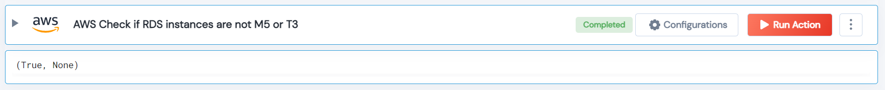

 
<h1>AWS Check if RDS instances are not M5 or T3 </h1>

## Description
This Lego check for AWS RDS instances that are not M5 or T3.

## Lego Details

    aws_check_rds_non_m5_t3_instances(handle, region: str = "")

        handle: Object of type unSkript AWS Connector.
        region: Optional, AWS region. Eg: “us-west-2”

## Lego Input
This Lego take two inputs handle and region.

## Lego Output
Here is a sample output.

## See it in Action
You can see this Lego in action following this link [unSkript Live](https://us.app.unskript.io)