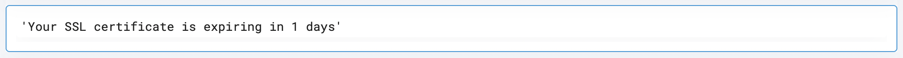

 
<h1>Check SSL Certificate Expiry</h1>

## Description
This Lego checks the expiry of an AWS ACM SSL certificate and shows the number of days remaining before expiry.

## Lego Details

    aws_check_ssl_certificate_expiry(handle, aws_certificate_arn: str, region: str)

        handle: Object of type unSkript AWS Connector.
        aws_certifcate_arn: ARN of the ACM Certificate.
        region: Region where the Certificate is present.

## Lego Input
This Lego take three inputs handle, aws_certificate_arn and region.

## Lego Output

## See it in Action

You can see this Lego in action following this link [unSkript Live](https://unskript.com)