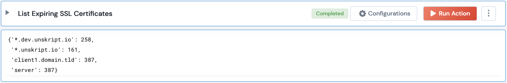

 
<h1>Check SSL Certificate Expiry</h1>

## Description
This Lego returns all the ACM issued certificates which are about to expire after a given threshold number of days

## Lego Details

    aws_check_ssl_certificate_expiry(handle, threshold_days: int, region: str)

        handle: Object of type unSkript AWS Connector.
        threshold_days: Integer, Threshold number of days to check for expiry. Eg: 30 -lists all certificates which are expiring within 30 days.
        region: String,  Region where the Certificates are present.

## Lego Input
handle: Object of type unSkript AWS Connector
threshold_days: Threshold number of days to check for expiry. Eg: 30
region: AWS Region name. Eg: "us-west-2"

## Lego Output

## See it in Action

You can see this Lego in action following this link [unSkript Live](https://us.app.unskript.io)