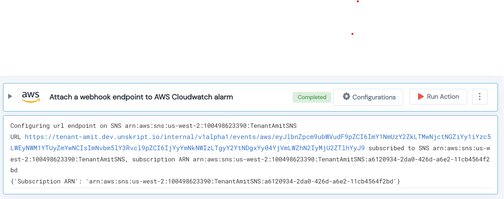

 
<h1>Attach a webhook endpoint to AWS Cloudwatch alarm </h1>

## Description
This Lego Attach a webhook endpoint to AWS Cloudwatch alarm.

## Lego Details

    aws_cloudwatch_attach_webhook_notification_to_alarm(hdl: Session, alarm_name: str, region: str, url: str)

        hdl: Object of type unSkript AWS Connector.
        alarm_name: Cloudwatch alarm name.
        url: URL where the alarm notification needs to be sent.
        region: AWS Region of the cloudwatch.

## Lego Input

This Lego take four inputs hdl, alarm_name, url and region.

## Lego Output
Here is a sample output.

## See it in Action

You can see this Lego in action following this link [unSkript Live](https://us.app.unskript.io)