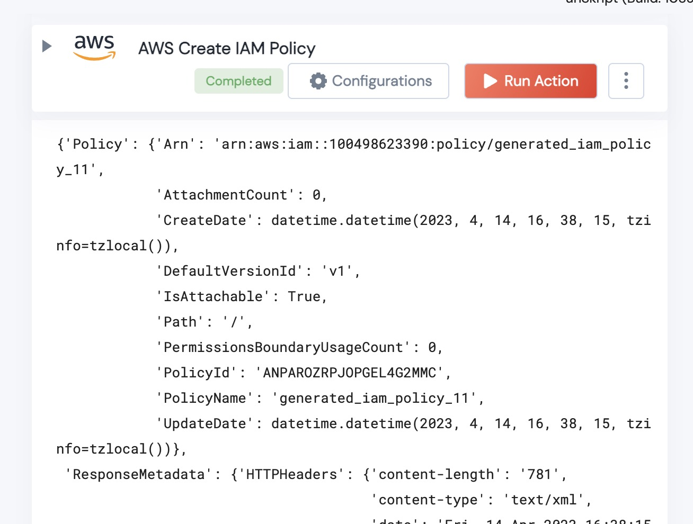

[]
(https://unskript.com/assets/favicon.png)
<h1>AWS Create IAM Policy</h1>

## Description
Given an AWS policy (as a string), and the name for the policy, this will create an IAM policy.

## Lego Details
	aws_create_IAMpolicy(handle, policyDocument:str, PolicyName:str)
		
		
	handle: Object of type unSkript AWS Connector.
	policyDocument: THE STRINGIFIED JSON OF THE POLICY
	PolicyName: the name of your new IAM policy.
	

## Lego Input
This Lego takes inputs handle,policyDocument and PolicyName

## Lego Output
Here is a sample output.

## See it in Action

You can see this Lego in action following this link [unSkript Live](https://us.app.unskript.io)