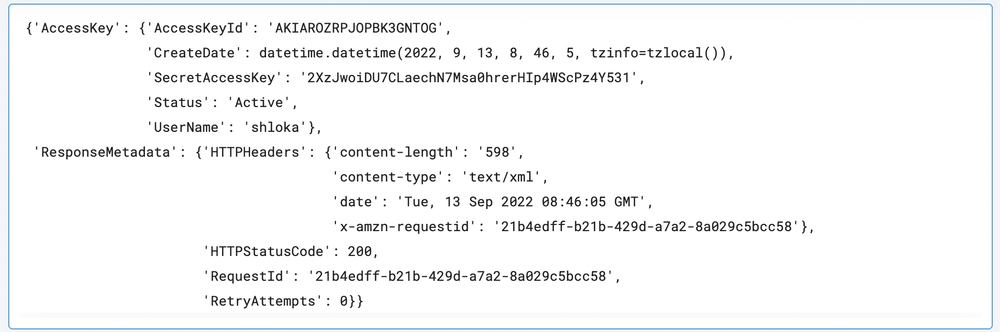

 
<h1>AWS Create Access Key</h1>

## Description
This Lego creates a new Access Key for the user.

## Lego Details

    aws_create_access_key(handle,aws_username: str)

        handle: Object of type unSkript AWS Connector.
        aws_username: User name of the AWS user.

## Lego Input
This Lego take two inputs handle and aws_username.

## Lego Output

## See it in Action

You can see this Lego in action following this link [unSkript Live](https://unskript.com)