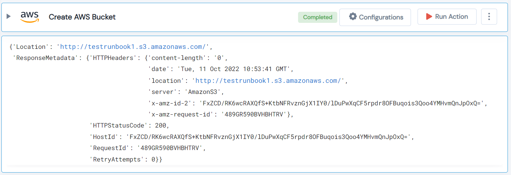

 
<h1>Create AWS Bucket</h1>

## Description
This Lego create a new AWS S3 Bucket.

## Lego Details

    aws_create_access_key(handle: object, name: str, acl: str, region: str)

        handle: Object of type unSkript AWS Connector.
        name: Name of the bucket to be created.
        acl: The Canned ACL to apply to the bucket. Possible values: private, public-read, public-read-write, authenticated-read.
        region: AWS Region of the bucket.
## Lego Input
This Lego take four inputs handle, name, acl and region.

## Lego Output
Here is a sample output.

## See it in Action

You can see this Lego in action following this link [unSkript Live](https://us.app.unskript.io)