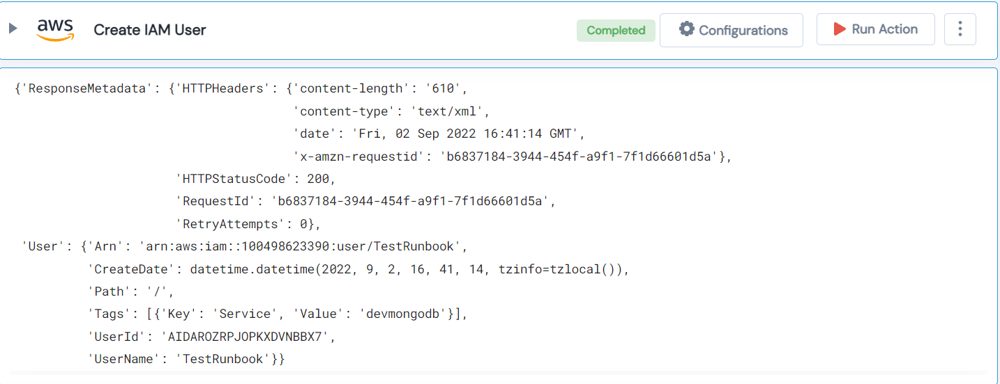

 
<h1>Create New IAM User </h1>

## Description
This Lego create new IAM User.

## Lego Details

    aws_create_iam_user(handle: object, user_name: str, tag_key: str, tag_value: str)

        handle: Object of type unSkript AWS Connector.
        user_name: Name of new IAM User.
        tag_key: Tag Key assign to new User.
        tag_value: Tag Value assign to new User.

## Lego Input
This Lego take four inputs handle, user_name, tag_key and tag_value.

## Lego Output
Here is a sample output.

## See it in Action

You can see this Lego in action following this link [unSkript Live](https://us.app.unskript.io)