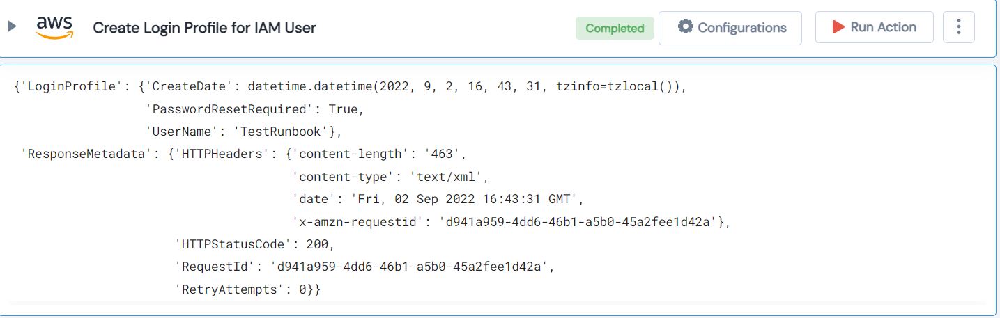

 
<h1>Create Login profile for IAM User </h1>

## Description
This Lego create login profile for IAM user.

## Lego Details

    aws_create_user_login_profile(handle: object, UserName: str, Password: str)

        handle: Object of type unSkript AWS Connector.
        UserName: Name of new IAM User.
        Password: temporary password for new User.

## Lego Input
This Lego take three inputs handle, UserName and Password.

## Lego Output
Here is a sample output.

## See it in Action

You can see this Lego in action following this link [unSkript Live](https://us.app.unskript.io)