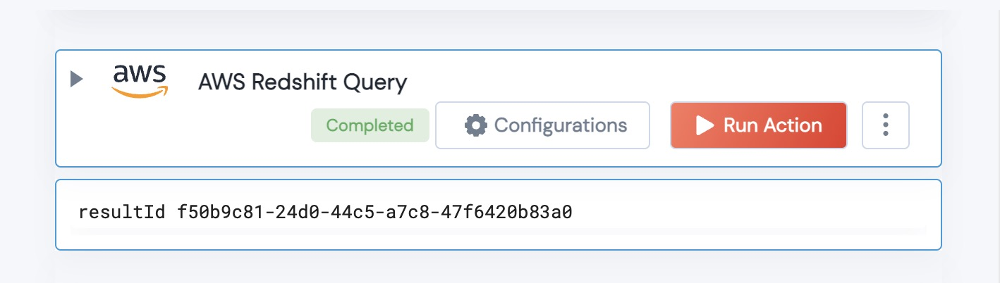

 
<h2>Get Datadog Handle</h2>

 

## Description
This Action Creates a Query on a RedShift Database

## Lego Details
    def aws_create_redshift_query(handle, region: str,cluster:str, database:str, secretArn: str, query:str) -> str:

        handle: Object of type unSkript datadog Connector
		region: AWS Region
		cluster: Name of the AWS redshift cluster
		database: database you wish to query
		secretArn: ARN used to connect tothe database
		query: the SQL Query

## Lego Input
        handle: Object of type unSkript datadog Connector
		region: AWS Region
		cluster: Name of the AWS redshift cluster
		database: database you wish to query
		secretArn: ARN used to connect tothe database
		query: the SQL Query

## Lego Output
Here is a sample output.

## See it in Action

You can see this Lego in action following this link [unSkript Live](https://us.app.unskript.io)