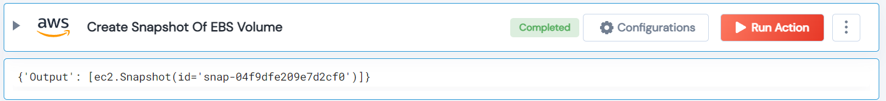

 
<h1>AWS Create Snapshot For Volume </h1>

## Description
This action create a snapshot for EBS volume of the EC2 Instance for backing up the data stored in EBS.

## Lego Details

    aws_create_volumes_snapshot(handle: object, volume_id: str, region: str)

        handle: Object of type unSkript AWS Connector.
        volume_id: Volume ID needed to create snapshot for particular volume.
        region: Used to filter the volume for specific region.

## Lego Input

This action take three inputs handle, volume_id and region.

## Lego Output
Here is a sample output.

## See it in Action

You can see this Lego in action following this link [unSkript Live](https://us.app.unskript.io)