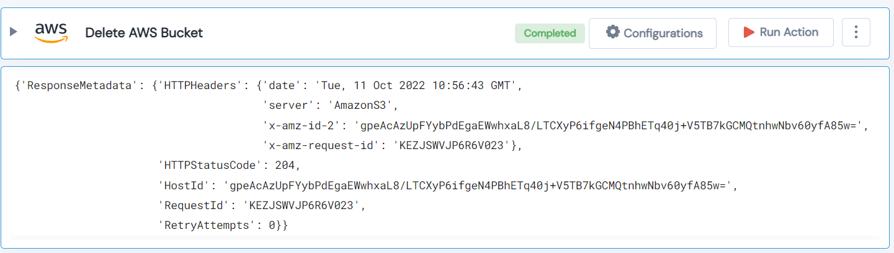

 
<h1>Delete AWS Bucket </h1>

## Description
This Lego delete AWS Bucket.

## Lego Details

    aws_delete_bucket(handle: object, name: str, region: str)

        handle: Object of type unSkript AWS Connector.
        name: Name of the bucket to be deleted.
        region: AWS Region of the bucket.

## Lego Input
This Lego take three inputs handle, name and region.

## Lego Output
Here is a sample output.

## See it in Action

You can see this Lego in action following this link [unSkript Live](https://us.app.unskript.io)