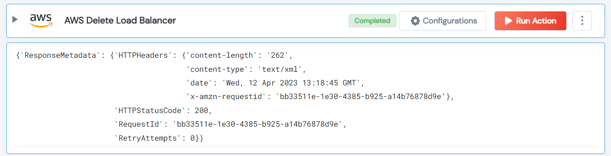

 
<h1>AWS Delete Load Balancer</h1>

## Description
This Lego delete AWS load balancer.

## Lego Details

    aws_delete_load_balancer(handle, region: str, elb_arn: str)

        handle: Object of type unSkript AWS Connector.
        elb_arn: load balancer ARNs.
        region: AWS Region.

## Lego Input
This Lego take three inputs handle, elb_arn and region.

## Lego Output
Here is a sample output.

## See it in Action

You can see this Lego in action following this link [unSkript Live](https://us.app.unskript.io)