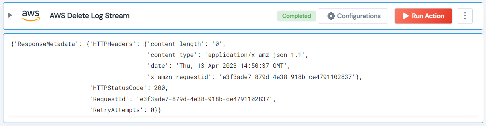

 
<h1>AWS Delete Log Stream</h1>

## Description
This Lego delete Log Streams.

## Lego Details

    aws_delete_log_stream(handle, log_group_name: str, log_stream_name: str, region: str)

        handle: Object of type unSkript AWS Connector.
        log_group_name: Name of the log group.
        log_stream_name: Name of the log stream.
        region: AWS Region.

## Lego Input
This Lego take four inputs handle, log_group_name, log_stream_name and region.

## Lego Output
Here is a sample output.

## See it in Action

You can see this Lego in action following this link [unSkript Live](https://us.app.unskript.io)