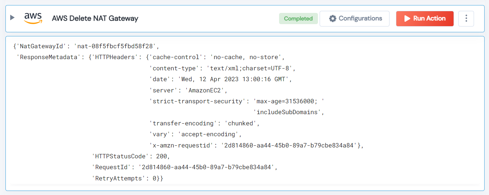

 
<h1>AWS Delete NAT Gateway</h1>

## Description
This Lego delete AWS NAT Gateway.

## Lego Details

    aws_delete_nat_gateway(handle, nat_gateway_id: str, region: str)

        handle: Object of type unSkript AWS Connector.
        nat_gateway_id: ID of the NAT Gateway.
        region: AWS Region.

## Lego Input
This Lego take three inputs handle, nat_gateway_id and region.

## Lego Output
Here is a sample output.

## See it in Action

You can see this Lego in action following this link [unSkript Live](https://us.app.unskript.io)