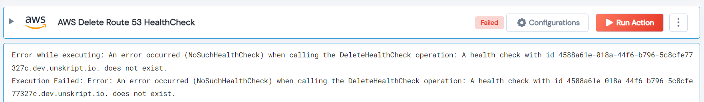

 
<h1>AWS Delete Route 53 HealthCheck</h1>

## Description
This Lego delete AWS Route 53 HealthCheck.

## Lego Details

    aws_delete_route53_health_check(handle, health_check_id: str)

        handle: Object of type unSkript AWS Connector.
        health_check_id: The ID of the Health Check to delete.

## Lego Input
This Lego take four inputs handle and health_check_id.

## Lego Output
Here is a sample output.

## See it in Action

You can see this Lego in action following this link [unSkript Live](https://us.app.unskript.io)