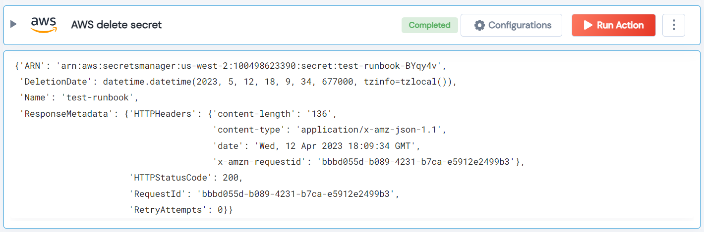

 
<h1>AWS Delete Secret</h1>

## Description
This Lego delete AWS Secret.

## Lego Details

    aws_delete_secret(handle, region: str, secret_name : str)

        handle: Object of type unSkript AWS Connector.
        secret_name: Name of the secret to be deleted.
        region: AWS Region.

## Lego Input
This Lego take three inputs handle, secret_name and region.

## Lego Output
Here is a sample output.

## See it in Action

You can see this Lego in action following this link [unSkript Live](https://us.app.unskript.io)