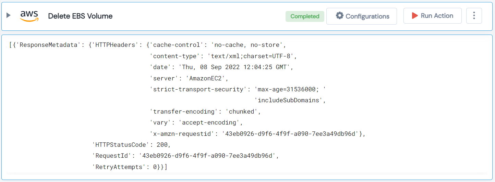

 
<h1>Delete AWS EBS Volume </h1>

## Description
This Lego deletes AWS EBS volume.

## Lego Details

    aws_delete_volumes(handle: object, volume_id: str, region: str)

        handle: Object of type unSkript AWS Connector.
        volume_id: Volume ID to delete particular volume.
        region: Used to filter the volume for specific region.

## Lego Input

This Lego take three inputs handle, volume_id and region.

## Lego Output
Here is a sample output.

## See it in Action

You can see this Lego in action following this link [unSkript Live](https://us.app.unskript.io)