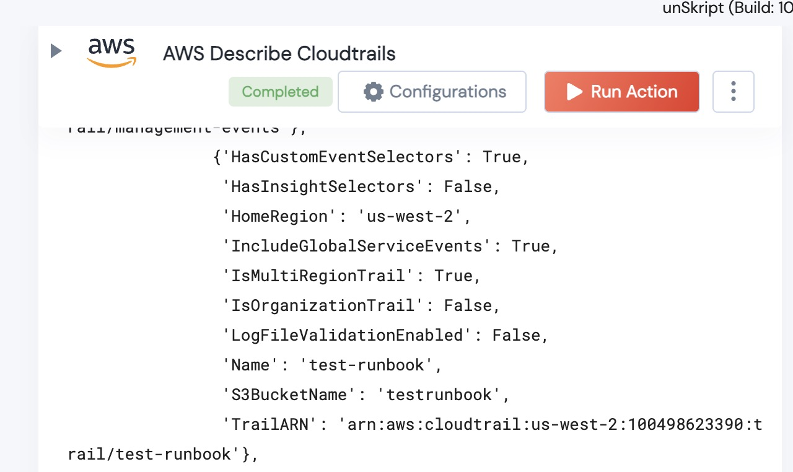

[]
(https://unskript.com/assets/favicon.png)
<h1>AWS Describe Cloudtrails </h1>

## Description
Given an AWS Region, this Action returns a Dict with all of the Cloudtrail logs being recorded

## Lego Details
	aws_describe_cloudtrail(handle, region:str)
		handle: Object of type unSkript AWS Connector.

	Region you wish to get cloudtrail log list from.

## Lego Input
This Lego takes inputs handle, and region

## Lego Output
Here is a sample output.

## See it in Action

You can see this Lego in action following this link [unSkript Live](https://us.app.unskript.io)