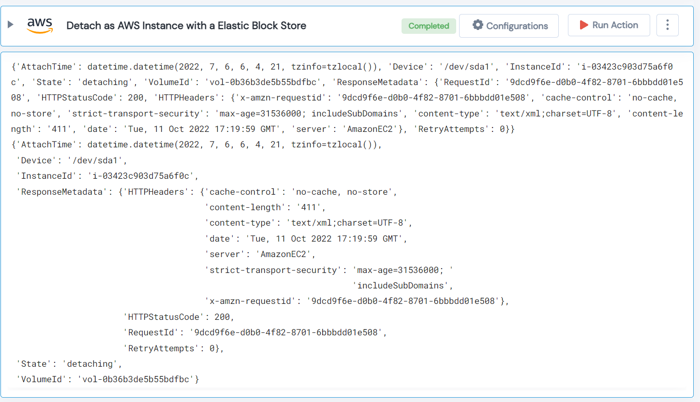

 
<h1>Detach as AWS Instance with a Elastic Block Store </h1>

## Description
This Lego detach as AWS instance with a Elastic Block Store.

## Lego Details

    aws_detach_ebs_to_instances(handle: object, region: str, volume_id: str)

        handle: Object of type unSkript AWS Connector.
        volume_id: The ID of the volume.
        region: AWS Region of the ESB.

## Lego Input

This Lego take three inputs handle, volume_id and region.

## Lego Output
Here is a sample output.

## See it in Action

You can see this Lego in action following this link [unSkript Live](https://us.app.unskript.io)