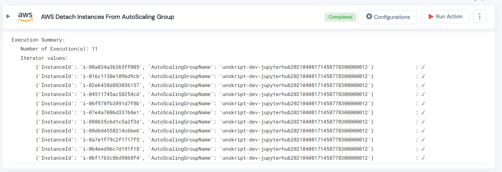

 
<h1>AWS Detach Instances From AutoScaling Group </h1>

## Description
This Lego detach AWS instances from autoscaling group.

## Lego Details

    aws_detach_autoscaling_instances(handle,instance_id: str,group_name: str,region: str)

        handle: Object of type unSkript AWS Connector
        instance_ids: Name of instances.
        group_name: Name of AutoScaling Group.
        region: Used to filter the volume for specific region.

## Lego Input
This Lego take four inputs handle, instance_ids, group_name and region.

## Lego Output
Here is a sample output.

## See it in Action

You can see this Lego in action following this link [unSkript Live](https://us.app.unskript.io)