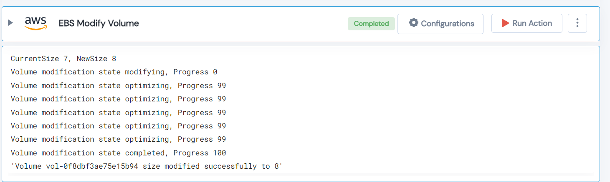

 
<h1>EBS Modify Volume</h1>

## Description
This Lego Modify/Resize volume for Elastic Block Storage (EBS).

## Lego Details

    aws_ebs_modify_volume(hdl: Session, volume_id: str, resize_option: SizingOption, resize_value: float, region: str,)

        hdl: Object of type unSkript AWS Connector
        volume_id: EBS Volume ID to resize.
        resize_option: Option to resize the volume.
        resize_value: Based on the resize option chosen, specify the value.
        region: AWS Region of the volume.

## Lego Input
This Lego take five inputs hdl, volume_id, resize_option, resize_value and region.

## Lego Output
Here is a sample output.

## See it in Action

You can see this Lego in action following this link [unSkript Live](https://us.app.unskript.io)