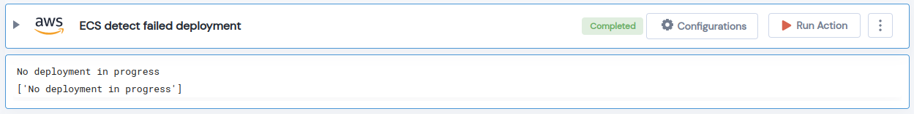

 
<h1>ECS detect failed deployment </h1>

## Description
This Lego shows the list of stopped tasks, associated with a deployment, along with their stopped reason.

## Lego Details

    aws_ecs_detect_failed_deployment(handle, cluster_name: str, service_name: str, region: str)

        handle: Object of type unSkript AWS Connector
        cluster_name: Cluster name that your service runs on.
        service_name: ECS Service name in the specified cluster.
        region: AWS Region of the ECS service..

## Lego Input
This Lego takes four inputs handle, region, cluster_name  and service_name. 

## Lego Output
Here is a sample output.

## See it in Action

You can see this Lego in action following this link [unSkript Live](https://us.app.unskript.io)