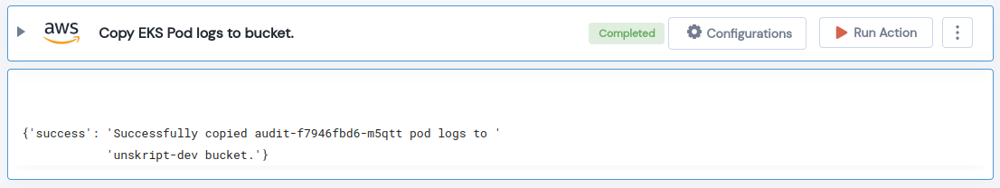

 
<h1>Copy EKS Pod logs to bucket. </h1>

## Description
This Lego Copy given EKS pod logs to given S3 Bucket.

## Lego Details

    aws_eks_copy_pod_logs_to_bucket(handle, clusterName: str, namespaceName: str, podName: str, bucketName: str,region: str)

        handle: Object of type unSkript AWS Connector
        clusterName: Name of the EKS cluster.
        podName: Name of the pod.
        bucketName: Name of the S3 bucket.
        region: AWS Region of the EKS cluster. 
        namespaceName: EKS Cluster Namespace.

## Lego Input
This Lego take six input handle, clusterName, podName, bucketName, namespaceName and region. 

## Lego Output
Here is a sample output.

## See it in Action

You can see this Lego in action following this link [unSkript Live](https://us.app.unskript.io)