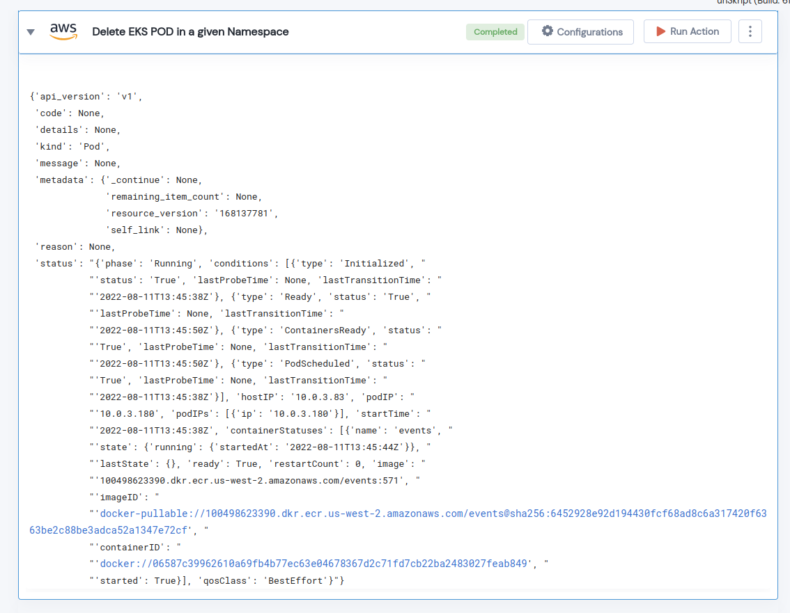

 
<h1>Delete EKS POD in a given Namespace </h1>

## Description
This Lego Delete a EKS POD in a given Namespace.

## Lego Details

    aws_eks_delete_pod(handle, clusterName: str, namespace: str, podname: str, region: str)

        handle: Object of type unSkript AWS Connector
        clusterName: Name of the EKS cluster.
        region: AWS Region of the EKS cluster. 
        namespace: EKS Cluster Namespace.
        podname: Name of pod to be deleted.

## Lego Input
This Lego takes five inputs handle, clusterName, podname, region and namespace. 

## Lego Output
Here is a sample output.

## See it in Action

You can see this Lego in action following this link [unSkript Live](https://us.app.unskript.io)