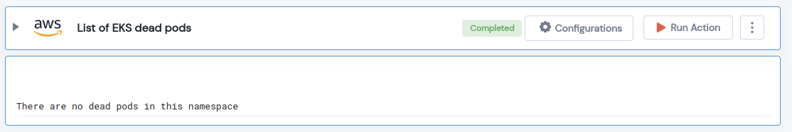

 
<h1>List of EKS dead pods</h1>

## Description
This Lego Get list of all dead pods in a given EKS cluster.

## Lego Details

    aws_eks_get_all_dead_pods(handle: Session,clusterName: str,region: str, namespace: str = 'all',) -> List:

        handle: Object of type unSkript AWS Connector
        clusterName: Name of the EKS cluster.
        region: AWS Region of the EKS cluster. 
        namespace: EKS Cluster Namespace.

## Lego Input
This Lego takes four inputs handle, clusterName, region and namespace.  

## Lego Output
Here is a sample output.

## See it in Action

You can see this Lego in action following this link [unSkript Live](https://us.app.unskript.io)