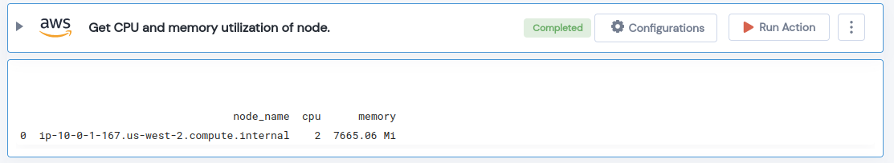

 
<h1>Get CPU and memory utilization of node </h1>

## Description
This Lego Gets CPU and memory utilization of given node.

## Lego Details

    aws_eks_get_node_cpu_memory(handle: Session, clusterName: str, region: str, nodeName: str = None)

        handle: Object of type unSkript AWS Connector
        clusterName: Name of the EKS cluster.
        region: AWS Region of the EKS cluster. 
        nodeName: Node name of EKS cluster.

## Lego Input
This Lego takes four inputs handle, clusterName, region and nodeName.

## Lego Output
Here is a sample output.

## See it in Action

You can see this Lego in action following this link [unSkript Live](https://us.app.unskript.io)