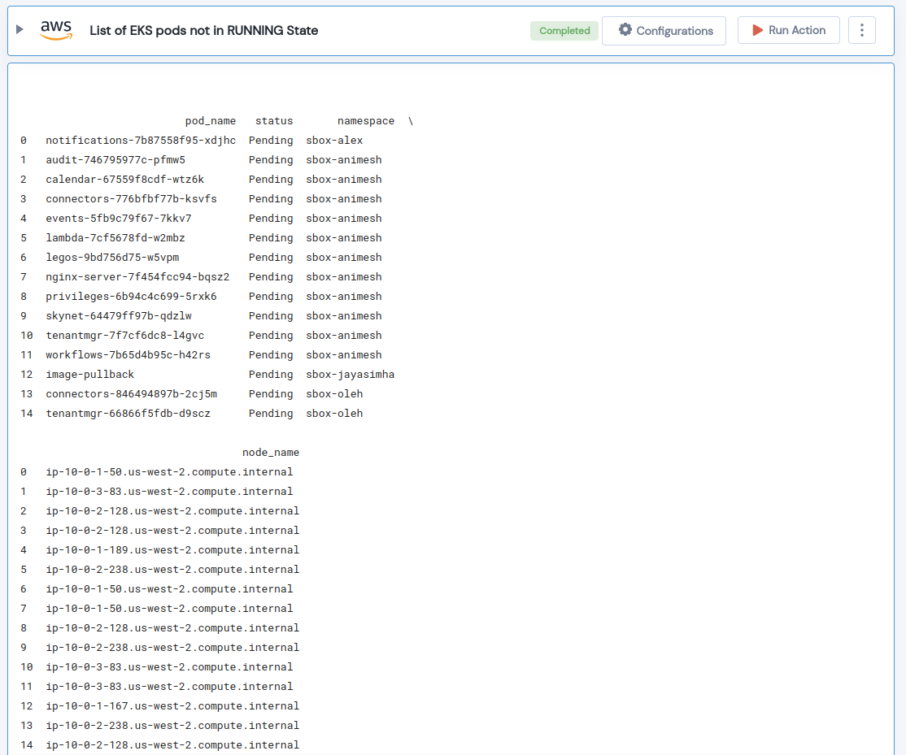

 
<h1>List of EKS pods not in RUNNING State </h1>

## Description
Get list of all pods in a given EKS cluster that are not running.

## Lego Details

    aws_eks_get_not_running_pods(handle: Session, clusterName: str, region: str)

        handle: Object of type unSkript AWS Connector
        clusterName: Name of the EKS cluster.
        region: AWS Region of the EKS cluster. 

## Lego Input
This Lego takes three inputs handle, clusterName and region. 

## Lego Output
Here is a sample output.

## See it in Action

You can see this Lego in action following this link [unSkript Live](https://us.app.unskript.io)