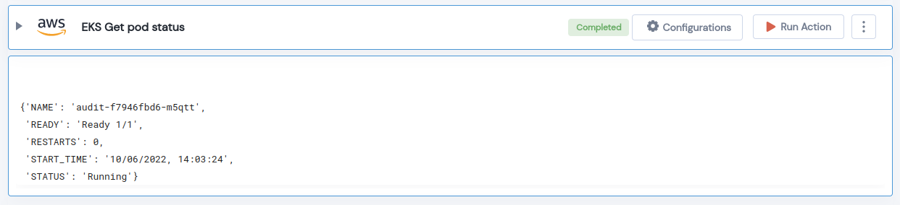

 
<h1>EKS Get pod status </h1>

## Description
This Lego Get a Status of given POD in a given Namespace and EKS cluster name.

## Lego Details

    aws_eks_get_pod_status(handle: Session, clusterName: str, pod_name: str, region: str, namespace: str = None)

        handle: Object of type unSkript AWS Connector
        clusterName: Name of the EKS cluster.
        pod_name: Name of the pod.
        region: AWS Region of the EKS cluster. 
        namespace: EKS Cluster Namespace.

## Lego Input
This Lego takes five inputs handle, clusterName, pod_name, region and namespace. 

## Lego Output
Here is a sample output.

## See it in Action

You can see this Lego in action following this link [unSkript Live](https://us.app.unskript.io)