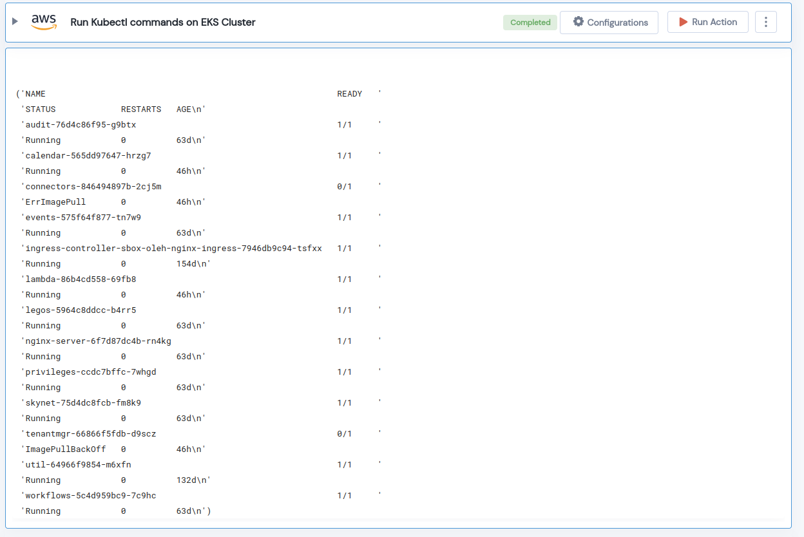

 
<h1>Run Kubectl commands on EKS Cluster </h1>

## Description
This lego runs a kubectl command on an AWS EKS Cluster.

## Lego Details

    aws_eks_run_kubectl_cmd(handle, clusterName: str, command: str, region: str)

        handle: Object of type unSkript AWS Connector
        clusterName: Name of the EKS cluster.
        command: Kubectl command to run on EKS Cluster.
        region: AWS Region of the EKS cluster. 

## Lego Input
This Lego take four input handle, command, clusterName and region. 

## Lego Output
Here is a sample output.

## See it in Action

You can see this Lego in action following this link [unSkript Live](https://us.app.unskript.io)