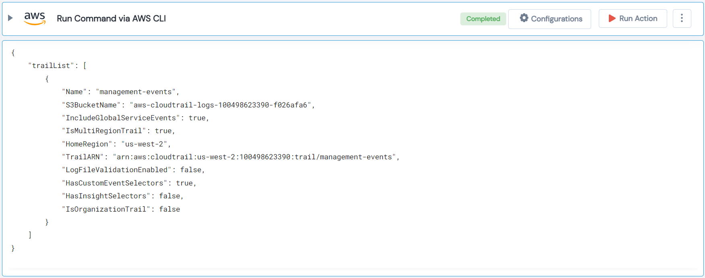

 
<h1>Run Command via AWS CLI </h1>

## Description
This Lego can be used to run any aws cli command just like `aws sts get-caller-identity` etc...

## Lego Details

    aws_execute_cli_command(handle, aws_command: str)

        handle: Object of type unSkript AWS Connector
        aws_command: AWS command.

## Lego Input
This Lego take two inputs handle, aws_command. The aws_command is the actual command
starting with the `aws` keyword.

## Lego Output
Here is a sample output.

## See it in Action

You can see this Lego in action following this link [unSkript Live](https://unskript.com)
