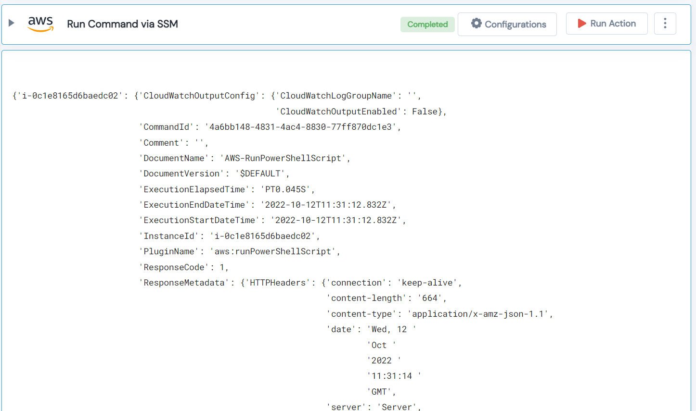

 
<h1>Run Command via SSM</h1>

## Description
This Lego execute command on EC2 instance(s) using SSM.

## Lego Details

    aws_execute_command_ssm(handle, instance_ids: list, parameters: list, region: str,
                            document_name: str)

        handle: Object of type unSkript AWS Connector
        instance_ids: List of instance IDs. For eg. ["i-foo", "i-bar"].
        parameters: List of commands to execute on instance. For eg. ["ifconfig", "pwd"].
        document_name: Document Name.
        region: AWS Region of the AWS Instance.

## Lego Input
This Lego take five inputs handle, instance_ids, parameters, document_name and region.

## Lego Output
Here is a sample output.

## See it in Action

You can see this Lego in action following this link [unSkript Live](https://us.app.unskript.io)