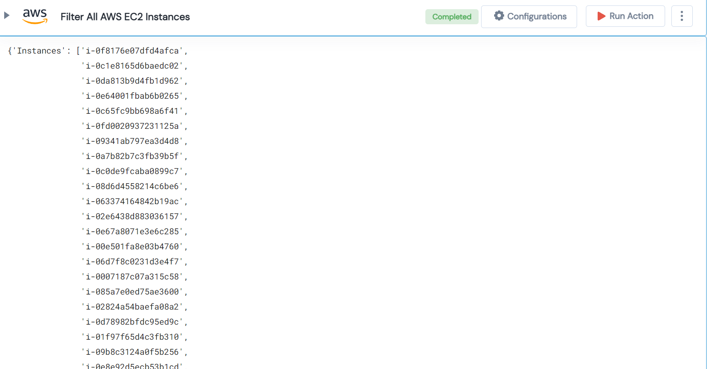

 
<h1>Filter All AWS EC2 Instances </h1>

## Description
This Lego filter the AWS EC2 Instance and gives a list of Instances.

## Lego Details

    aws_filter_ec2_instances(handle: object, region: str)

        handle: Object of type unSkript AWS Connector
        region: Used to filter the volume for specific region.

## Lego Input
This Lego take one input region. 

## Lego Output
Here is a sample output.

## See it in Action

You can see this Lego in action following this link [unSkript Live](https://unskript.com)