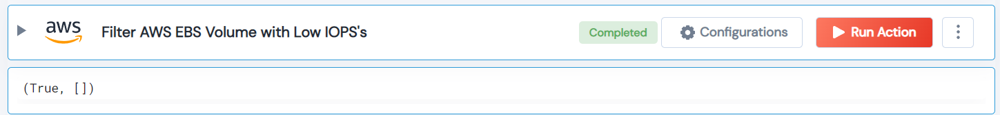

 
<h1>Filter AWS EBS Volume with Low IOPS </h1>

## Description
This Lego used to measure the amount of input/output operations that an EBS volume can perform per second and gives a list of volume with low IOPS.

## Lego Details

    aws_filter_ebs_volumes_with_low_iops(handle, region: str = "", iops_threshold: int = 100)

        handle: Object of type unSkript AWS Connector.
        region: Optional, AWS region. Eg: “us-west-2”
        iops_threshold: Optional, IOPS's Threshold e.g 100

## Lego Input
This Lego take three inputs handle, iops_threshold and region.
iops_threshold: If not provided the value is set to 100.
region: If not provided it will get all regions from AWS.

## Lego Output
Here is a sample output.

## See it in Action
You can see this Lego in action following this link [unSkript Live](https://us.app.unskript.io)