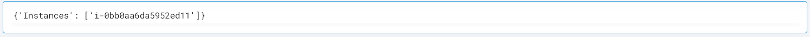

 
<h1>Filter AWS EC2 Instances </h1>

## Description
This Lego filter the AWS EC2 Instance and gives a list of Instances.

## Lego Details

    aws_filter_ec2_by_tags(handle: object)

        handle: Object of type unSkript AWS Connector

## Lego Input
This Lego take four inputs handle and region, tag_key, tag_value. 

## Lego Output
Here is a sample output.

## See it in Action

You can see this Lego in action following this link [unSkript Live](https://unskript.com)