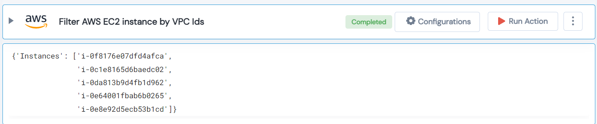

 
<h1>Filter AWS EC2 instance by VPC Ids </h1>

## Description
This Lego filter AWS EC2 Instance by VPC Ids.

## Lego Details

    aws_filter_ec2_by_vpc(handle: object, vpc_id: str, region: str)

        handle: Object of type unSkript AWS Connector.
        vpc_id: VPC ID of the instances.
        region: AWS Region.

## Lego Input

This Lego take three inputs handle, vpc_id and region. 

## Lego Output
Here is a sample output.

## See it in Action

You can see this Lego in action following this link [unSkript Live](https://us.app.unskript.io)