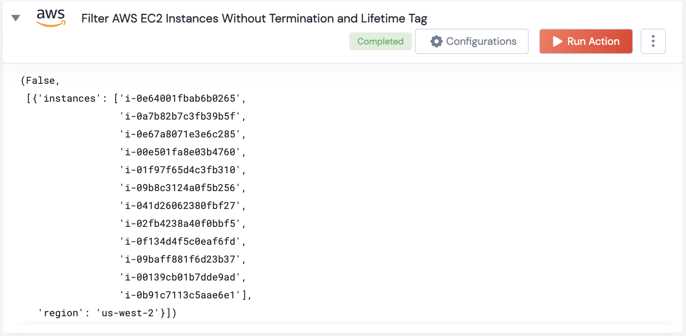

 
<h1>Filter AWS EC2 Instances Without Termination and Lifetime Tag</h1>

## Description
This Lego Filter Instances without Termination and Lifetime Tag and check of they are valid

## Lego Details

    aws_filter_instances_without_termination_and_lifetime_tag(handle: object,region: str, termination_tag_name:str,lifetime_tag_name:str )

        handle: Object of type unSkript AWS Connector.
        region: Optional, AWS region. Eg: "us-west-2"
        termination_tag_name: Optional, Name of the Termination Date Tag given to an EC2 instance. By default "terminationDateTag" is considered 
        lifetime_tag_name: Optional, Name of the Lifetime Date Tag given to an EC2 instance. By default "lifetimeTag" is considered 

## Lego Input
This Lego take 4 inputs handle, region, termination_tag_name, lifetime_tag_name

## Lego Output
Here is a sample output.

## See it in Action

You can see this Lego in action following this link [unSkript Live](https://us.app.unskript.io)