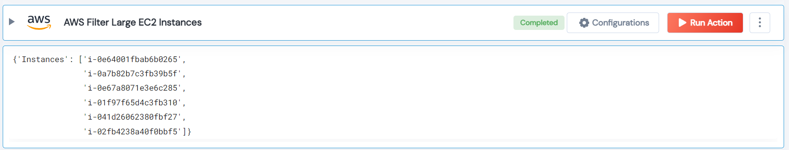

 
<h1>AWS Filter Large EC2 Instances </h1>

## Description
This Lego filter all instances whose instanceType contains Large or xLarge, and that DO NOT have the largetag key/value.

## Lego Details

    aws_filter_large_ec2_instances(handle, tag_key: str, tag_value: str, region: str)

        handle: Object of type unSkript AWS Connector
        tag_key: The key for the EC2 instance tag.
        tag_value: The value for the EC2 instance tag.
        region: EC2 instance region.

## Lego Input
This Lego take four inputs handle, tag_key, tag_value and region.

## Lego Output
Here is a sample output.

## See it in Action

You can see this Lego in action following this link [unSkript Live](https://unskript.com)