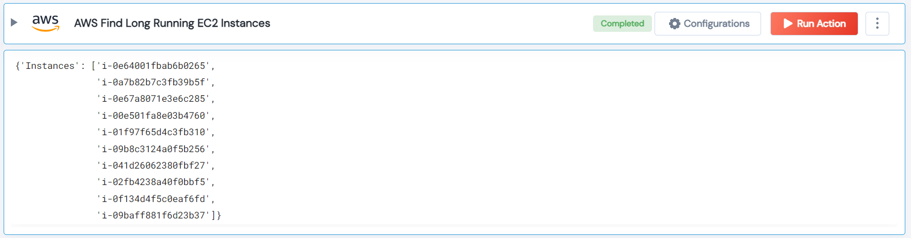

 
<h1>AWS Find Long Running EC2 Instances</h1>

## Description
This Lego used to get a list a all instances that are older than the threshold.

## Lego Details

    aws_filter_long_running_instances(handle, region: str, threshold: int = 10)

        handle: Object of type unSkript AWS Connector.
        threshold: (in days) The threshold to check the instances older than the threshold.
        region: AWS Region.
## Lego Input

This Lego take three inputs handle, threshold and region.

## Lego Output
Here is a sample output.

## See it in Action

You can see this Lego in action following this link [unSkript Live](https://us.app.unskript.io)