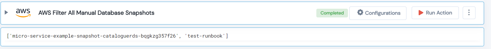

 
<h1>AWS Filter All Manual Databse Snapshots </h1>

## Description
This Lego filter AWS manual database snapshots.

## Lego Details

    aws_get_manual_database_snapshots(handle: object, region: str)

        handle: Object of type unSkript AWS Connector
        region: Region for database.

## Lego Input
This Lego take two inputs handle and region. 

## Lego Output
Here is a sample output.

## See it in Action

You can see this Lego in action following this link [unSkript Live](https://us.app.unskript.io)