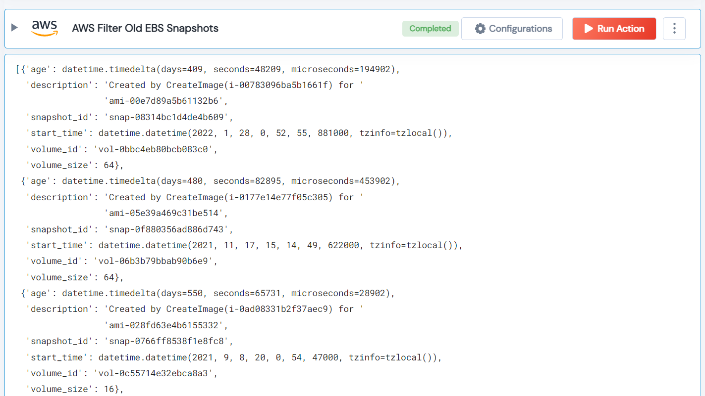

 
<h1>AWS Filter Old EBS Snapshots </h1>

## Description
This Lego used to get a list of all snapshots details that are older than the threshold.

## Lego Details

    aws_filter_old_ebs_snapshots(handle, region: str, threshold: int = 30)

        handle: Object of type unSkript AWS Connector.
        region: EC2 instance region.
        threshold: (in days) The threshold to check the snapshots older than the threshold.

## Lego Input

This Lego take three inputs handle, threshold and region. 

## Lego Output
Here is a sample output.

## See it in Action
You can see this Lego in action following this link [unSkript Live](https://us.app.unskript.io)