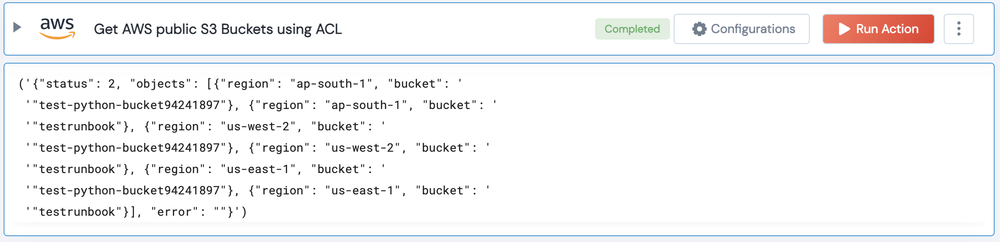

 
<h1>Get AWS public S3 Buckets</h1>

## Description
This Lego gets publicly accessbiel AWS s3 buckets.

## Lego Details

    aws_get_public_s3_buckets(handle: object, bucket_List: list, permission: str, region: str)

        handle: Object of type unSkript AWS Connector.
        bucket_List: list of S3 buckets.
        permission: 'ACL type - "READ"|"WRITE"|"READ_ACP"|"WRITE_ACP"|"FULL_CONTROL".'
        region: Used to filter the volume for specific region.

## Lego Input
This Lego take four inputs handle, bucket_List, permission and region.

## Lego Output
Here is a sample output.

## See it in Action

You can see this Lego in action following this link [unSkript Live](https://us.app.unskript.io)
