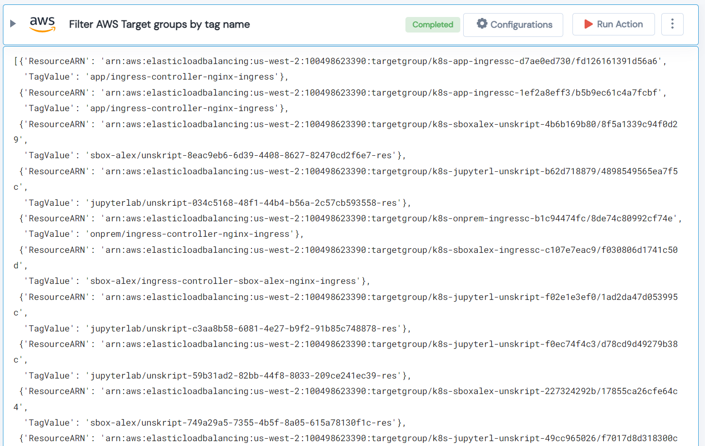

 
<h1>Filter AWS Target groups by tag name </h1>

## Description
This Lego filter AWS Target groups which have the provided tag attached to it.

## Lego Details

    aws_filter_target_groups_by_tags(handle: object, tag_key: str, region: str)

        handle: Object of type unSkript AWS Connector.
        tag_key: Name of the tag to filter by.
        region: AWS Region.

## Lego Input

This Lego take three inputs handle, tag_key and region. 

## Lego Output
Here is a sample output.

## See it in Action

You can see this Lego in action following this link [unSkript Live](https://us.app.unskript.io)